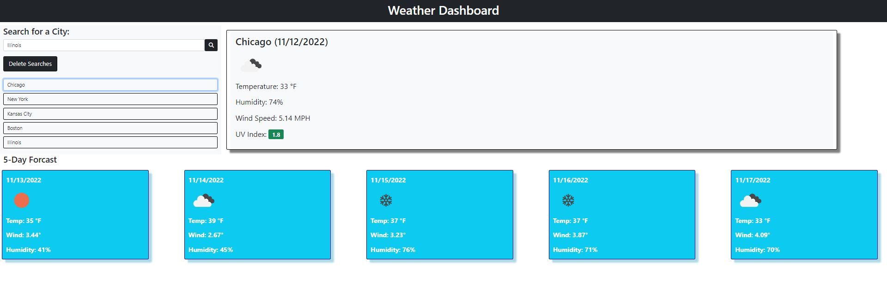
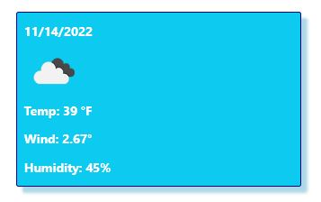
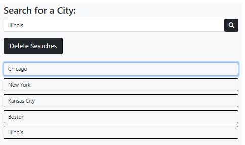

    
# Project Title: Weather Dashboard ER2

## Description
    A weather dashboard using the Open Weather API

- - - - -

## Table of Contents

* [Installation](#installation)
* [Usage](#usage)
* [License](#license)
* [Contributors](#contributors)
* [Test](#test)
* [Questions](#questions)

Weather Dashboard image:

5-day Weather card:

Weather form:

## Installation
    Download the repository and open the index.html in a Live Server window.   Then type in the city that you would like to view the weather for and click the search button (magnifying glass)  Old searches will be stored in  the history sidebar if you would like to revisit a location. 

## Usage
    This project can be used to check your local weather or if you would like to plan a trip and check the weather in other locations as well.

## License
    This application is  covered under the [Unlicense] license.

## Contributors
    Study Group, I received advise from several classmates, and youtube.  The Open Weather API documentation.

## Test Instructions
    To test please follow the directions for installation, and test the search field with various locations.

## Questions

Please feel free to send questions via my GitHub profile: [senseier2](https://github.com/senseier2)
Or email me via: eric.mcghee@northwestern.edu
    